# Cozy Comfort — Service-Oriented Architecture
## SOC/SOA Academic Assignment Report

> **Student:** [Your Name]
> **Module:** Service-Oriented Computing
> **Date:** July 2026
> **Technology Stack:** .NET 10 · ASP.NET Core Web API · Entity Framework Core · SQL Server · HTML/CSS/JavaScript

---

## Table of Contents

1. [Task 1 — Monolithic vs. SOA Architecture Comparison](#task-1)
2. [Task 2 — SOA Application Design and Development](#task-2)
3. [Task 3 — Testing and Debugging](#task-3)
4. [Task 4 — Deployment Techniques](#task-4)

---

## Task 1 — Monolithic vs. SOA: Comparison, Contrast, and Justification
*(20 Marks — LO1)*

### 1.1 Background

Cozy Comfort currently manages its supply chain through manual communication — emails, phone calls, and spreadsheets shared between Manufacturers, Distributors, and Sellers. This introduces latency, data inconsistency, and an inability to scale individual bottlenecks. A software-based solution is required, and the choice of architecture directly determines its long-term success.

---

### 1.2 Monolithic Architecture

A **monolithic application** is one where all functional components — UI, business logic, and data access — are compiled and deployed as a single, indivisible unit.

#### Advantages of Monolithic for Cozy Comfort

| Advantage | Explanation |
|-----------|-------------|
| **Simple to develop initially** | One codebase, one deployment — no network complexity |
| **Easy debugging** | All code runs in one process; stack traces are straightforward |
| **Low latency** | In-process function calls instead of HTTP/network round-trips |
| **Simple transactions** | Database transactions span the entire operation natively |

#### Disadvantages of Monolithic for Cozy Comfort

| Disadvantage | Impact on Cozy Comfort |
|---|---|
| **Tight coupling** | A bug in the Seller module can bring down Manufacturer operations |
| **Scaling bottleneck** | If Seller order volume spikes, the entire application must be scaled |
| **Deployment risk** | Any change requires redeploying the entire application |
| **Technology lock-in** | Cannot use a different language or framework for one module |
| **Team friction** | All three business domains share one codebase, causing merge conflicts |
| **Single point of failure** | If the process crashes, all three roles become unavailable |

---

### 1.3 Service-Oriented Architecture (SOA)

**Service-Oriented Architecture (SOA)** is a design paradigm where the application is composed of **independently deployable services**, each exposing well-defined contracts (APIs). Services communicate via standardised protocols (REST/HTTP). Each service owns its own domain and can be developed, deployed, and scaled independently.

#### Advantages of SOA for Cozy Comfort

| Advantage | Explanation |
|-----------|-------------|
| **Loose coupling** | The Seller Service can be updated without touching Distributor or Manufacturer |
| **Independent scalability** | During peak season, only the Seller Service can be scaled horizontally |
| **Fault isolation** | A crash in the Distributor Service does not affect Seller or Manufacturer |
| **Technology flexibility** | Each service can be built with a different technology if needed |
| **Parallel development** | Three teams can simultaneously develop their respective services |
| **Reusability** | The AvailabilityRequest service API can be consumed by multiple clients |
| **Clear business alignment** | Each service maps directly to a real business domain |

#### Disadvantages of SOA for Cozy Comfort

| Disadvantage | Mitigation |
|---|---|
| **Increased network complexity** | Managed by clear API contracts (REST + Scalar docs) |
| **Distributed tracing is harder** | Logging and request correlation identifiers address this |
| **Data consistency challenges** | Handled through compensating transactions and EF Core |

---

### 1.4 Comparison Table

| Dimension | Monolithic | SOA |
|---|---|---|
| **Deployment** | Single unit; any change redeploys all | Each service deployed independently |
| **Scalability** | Scale the entire app | Scale only the bottleneck service |
| **Maintainability** | Hard — modules tightly coupled | High — services are isolated |
| **Fault Tolerance** | Single point of failure | Failure is contained to one service |
| **Development Speed (short-term)** | Fast to start | Slightly more setup |
| **Development Speed (long-term)** | Slows as codebase grows | Remains manageable per service |
| **Testing** | One test suite, harder to isolate | Services tested independently |
| **Technology Diversity** | Locked to one stack | Each service can use different tech |
| **Team Independence** | Low — all teams share one repo | High — teams own their service |

---

### 1.5 Justification: SOA is the Best Architecture for Cozy Comfort

SOA is the clearly superior architecture for this case study for three principal reasons:

1. **Business Domain Alignment**: The three actors — Manufacturer, Distributor, Seller — have entirely distinct responsibilities, data, and workflows. SOA maps each to an independent service, respecting the natural domain boundary and enabling each team to iterate at their own pace.

2. **Scalability**: Order processing at the Seller level is the most volatile component. During a sale event, only the Seller Service needs to scale, leaving Manufacturer and Distributor services at normal capacity. A monolithic approach would waste resources by scaling everything simultaneously.

3. **Maintainability**: With 17 distinct domain controllers, 17 application services, and 17 entity types, the Cozy Comfort application has significant complexity. SOA enforces separation of concerns through well-defined API contracts, making it possible to modify one business domain without risking regressions in another — aligning with SOLID principles at the architectural level.


---

## Task 2 — SOA Application Design and Development
*(60 Marks — LO2, LO3)*

### 2.1 Solution Architecture Overview

The Cozy Comfort SOA solution is structured as a layered .NET solution:

```
CozyComfort/
+-- CozyComfort.Domain/          # Entities, DTOs (shared kernel)
+-- CozyComfort.Data/            # EF Core DbContext, Migrations
+-- CozyComfort.Application/     # Service interfaces + implementations
+-- CozyComfort.Infrastucture/   # Cross-cutting concerns
+-- CozyComfort.API/             # ASP.NET Core Web API (hosts all 3 services)
+-- CozyComfort.Client/          # HTML/CSS/JS Single-Page Dashboard
```

The **same API project** is launched three times with different `SERVICE_ROLE` environment variables:

| Profile | SERVICE_ROLE | Port | Responsibilities |
|---------|-------------|------|-----------------|
| `SellerService` | `Seller` | `5010` | Customer orders, seller inventory, availability requests |
| `DistributorService` | `Distributor` | `5020` | Distributor inventory, transfer orders |
| `ManufacturerService` | `Manufacturer` | `5030` | Factory inventory, production capacity, blanket models |

---

### 2.2 Domain Model

The system manages 17 domain entities:

| Entity | Purpose | Owner Service |
|--------|---------|--------------|
| `Material` | Raw material types (cotton, wool, etc.) | Manufacturer |
| `BlanketModel` | Specific blanket SKUs with pricing | Manufacturer |
| `FactoryInventory` | Current stock at the factory | Manufacturer |
| `ProductionCapacity` | Daily/weekly production rates per model | Manufacturer |
| `Distributor` | Distributor company details | Distributor |
| `DistributorInventory` | Stock held by a distributor | Distributor |
| `Seller` | Retail seller (online/brick-and-mortar) | Seller |
| `SellerInventory` | Stock held by a seller | Seller |
| `Customer` | End consumer | Seller |
| `CustomerOrder` | An order placed by a customer | Seller |
| `CustomerOrderItem` | Line items within a customer order | Seller |
| `AvailabilityRequest` | Stock inquiry from Seller to Distributor to Manufacturer | All |
| `TransferOrder` | Physical goods movement between nodes | Distributor |
| `TransferOrderItem` | Line items within a transfer order | Distributor |
| `StockMovement` | Audit trail of all inventory changes | All |

---

### 2.3 System Design Diagrams (PlantUML & Draw.io)

This section provides the comprehensive system design models of the Cozy Comfort system. The editable **Draw.io XML** versions of these diagrams have been saved to your workspace for direct import:

*   📂 **Use Case Diagram:** [Use_Case_Diagram.drawio](file:///c:/Users/chami/source/repos/CozyComfort/Use_Case_Diagram.drawio)
*   📂 **UML Class Diagram:** [UML_Class_Diagram.drawio](file:///c:/Users/chami/source/repos/CozyComfort/UML_Class_Diagram.drawio)
*   📂 **ER Diagram:** [ER_Diagram.drawio](file:///c:/Users/chami/source/repos/CozyComfort/ER_Diagram.drawio)
*   📂 **Sequence Diagrams (3 Tabs/Use Cases):** [Sequence_Diagrams.drawio](file:///c:/Users/chami/source/repos/CozyComfort/Sequence_Diagrams.drawio)

*Tip: You can open these `.drawio` files directly in [Draw.io Desktop](https://www.drawio.com/) or import them at [diagrams.net](https://app.diagrams.net/) by clicking **File > Open From > Device...**.*

#### 2.3.1 Use Case Diagram

The Use Case diagram outlines system boundaries and roles (Customer, Seller, Distributor, and Manufacturer) interacting with the modular SOA service endpoints.

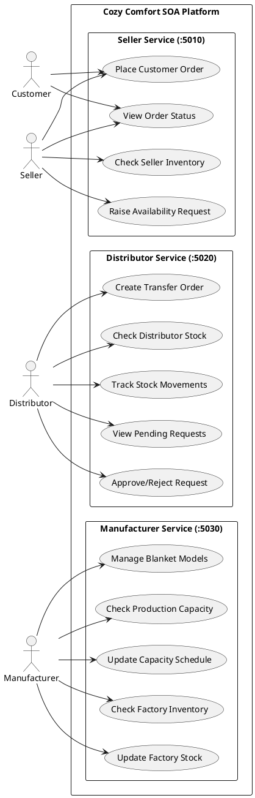

#### 2.3.2 UML Class Diagram

The class diagram maps the data models, interfaces, implementation services, and API controllers, demonstrating a decoupled architectural pattern.

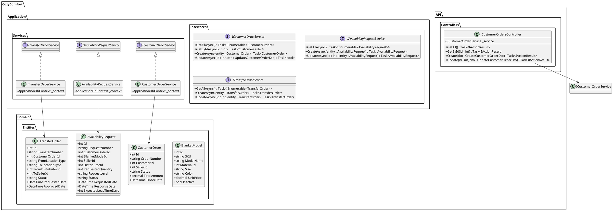

#### 2.3.3 Entity-Relationship (ER) Diagram

The ERD shows the database schema including primary keys (PK), foreign keys (FK), and logical relationships with Crow's Foot notations.

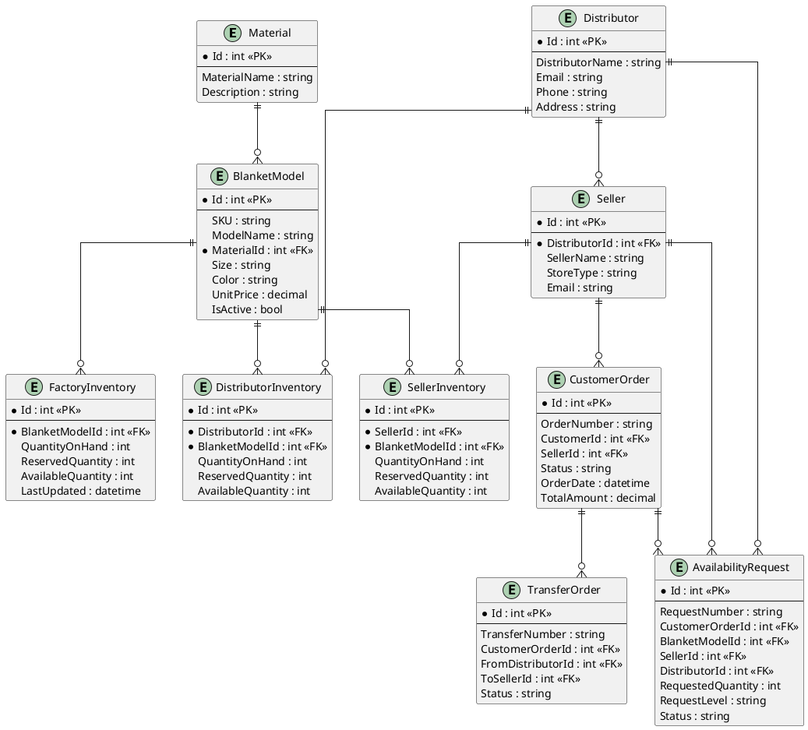

#### 2.3.4 Sequence Diagrams

##### Use Case 1: Customer Checkout and Supply Chain Escalation

This sequence represents the flow where a customer places an order at a seller store, the seller runs out of inventory, and the request escalates to the distributor.

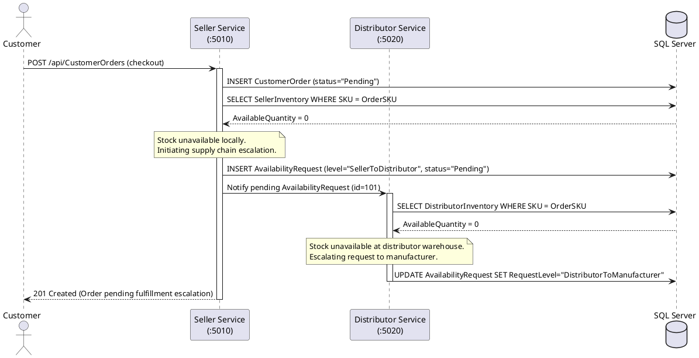

##### Use Case 2: Distributor Approval and Transfer Order Creation

This sequence represents the flow where a distributor approves an availability request and initiates a physical stock transfer order to the seller's storefront.

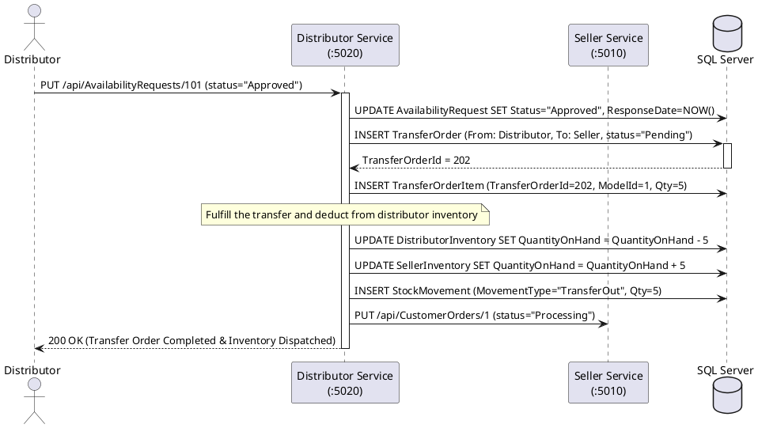

##### Use Case 3: Manufacturer Production Capacity Check

This sequence represents how the manufacturer service evaluates total capacity and pending workloads to calculate expected lead times for incoming manufacturer-level stock queries.

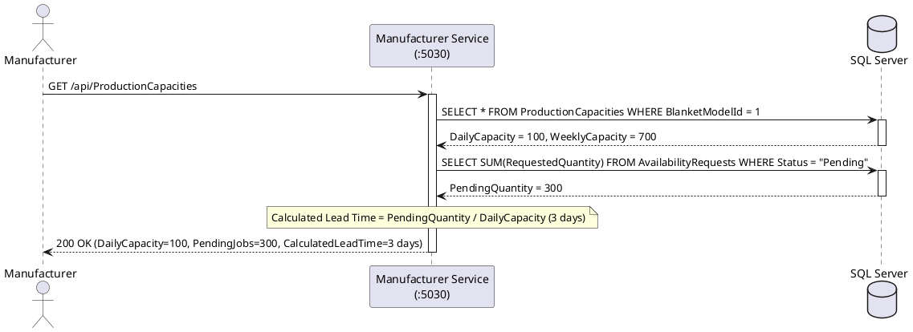

---

### 2.5 Project Layer Details

#### Domain Layer (CozyComfort.Domain)

Contains pure C# entity classes with no framework dependencies. Entities use Data Annotations for validation and `[JsonIgnore]` on navigation properties to prevent circular serialisation during OpenAPI schema generation:

```csharp
public class BlanketModel
{
    public int Id { get; set; }

    [Required, MaxLength(100)]
    public string SKU { get; set; } = string.Empty;

    [Required, MaxLength(150)]
    public string ModelName { get; set; } = string.Empty;

    public int MaterialId { get; set; }
    public Material? Material { get; set; }

    [Column(TypeName = "decimal(18,2)")]
    public decimal UnitPrice { get; set; }

    public bool IsActive { get; set; } = true;

    [JsonIgnore]  // Prevents circular reference in OpenAPI schema generator
    public ICollection<FactoryInventory> FactoryInventories { get; set; }
        = new List<FactoryInventory>();
}
```

#### Data Layer (CozyComfort.Data)

Uses Entity Framework Core 10 with ApplicationDbContext. Key configurations:

```csharp
// Computed column — AvailableQuantity = QuantityOnHand - ReservedQuantity
modelBuilder.Entity<DistributorInventory>()
    .Property(d => d.AvailableQuantity)
    .HasComputedColumnSql("[QuantityOnHand] - [ReservedQuantity]", stored: false);

// Referential integrity
modelBuilder.Entity<Seller>()
    .HasMany(s => s.CustomerOrders)
    .WithOne(co => co.Seller)
    .HasForeignKey(co => co.SellerId)
    .OnDelete(DeleteBehavior.Restrict);
```

Migrations are automatically applied at startup via `context.Database.Migrate()` and seeded with realistic test data through `DbSeeder.SeedData()`.

#### Application Layer (CozyComfort.Application)

Contains 17 service classes implementing typed interfaces:

```csharp
public interface ITransferOrderService
{
    Task<IEnumerable<TransferOrder>> GetAllAsync();
    Task<TransferOrder?> GetByIdAsync(int id);
    Task<TransferOrder> CreateAsync(TransferOrder entity);
    Task<TransferOrder?> UpdateAsync(int id, TransferOrder entity);
    Task<bool> DeleteAsync(int id);
}
```

| Service | Business Logic Highlights |
|---------|--------------------------|
| `CustomerOrderService` | Validates seller exists; links order to customer; sets initial status |
| `AvailabilityRequestService` | Tracks request level; records response date |
| `TransferOrderService` | Validates endpoints; updates inventory; creates StockMovement records |
| `DistributorInventoryService` | Checks available quantity; prevents negative stock |
| `ProductionCapacityService` | Tracks pending production; calculates lead time |

#### API Layer (CozyComfort.API)

All 17 controllers follow the same RESTful CRUD pattern:

```csharp
[ApiController]
[Route("api/[controller]")]
public class CustomerOrdersController : ControllerBase
{
    [HttpGet]    public async Task<ActionResult<IEnumerable<CustomerOrder>>> GetAll()
    [HttpGet("{id}")] public async Task<ActionResult<CustomerOrder>> GetById(int id)
    [HttpPost]   public async Task<ActionResult<CustomerOrder>> Create([FromBody] CustomerOrder entity)
    [HttpPut("{id}")] public async Task<ActionResult<CustomerOrder>> Update(int id, CustomerOrder entity)
    [HttpDelete("{id}")] public async Task<IActionResult> Delete(int id)
}
```

Scalar API documentation is available at `/scalar` on each service:
- Seller Service: http://localhost:5010/scalar
- Distributor Service: http://localhost:5020/scalar
- Manufacturer Service: http://localhost:5030/scalar

---

### 2.6 Client Application

The client is a single-page dashboard (`CozyComfort.Client/index.html`) built with vanilla HTML5, CSS3, and JavaScript.

| Section | Functionality |
|---------|--------------|
| **Seller Dashboard** | Place customer orders, view inventory, send availability requests |
| **Distributor Dashboard** | Process requests, approve transfer orders, manage stock |
| **Manufacturer Dashboard** | View factory inventory, inspect production capacities |
| **Supply Chain Status** | Real-time view of the end-to-end order lifecycle |

**Design features:** Dark glassmorphism theme, role-based tab navigation, toast notifications, responsive CSS Grid/Flexbox layout, smooth micro-animations.

---

### 2.7 API Endpoints Summary

#### Seller Service (http://localhost:5010)

| Method | Endpoint | Description |
|--------|----------|-------------|
| GET/POST | /api/CustomerOrders | List / Create customer orders |
| GET/PUT/DELETE | /api/CustomerOrders/{id} | Read / Update / Delete by ID |
| GET | /api/SellerInventories | List seller stock levels |
| GET/POST | /api/AvailabilityRequests | List / Create availability requests |
| GET | /api/Sellers | List sellers |
| GET | /api/Customers | List customers |

#### Distributor Service (http://localhost:5020)

| Method | Endpoint | Description |
|--------|----------|-------------|
| GET | /api/Distributors | List all distributors |
| GET/PUT | /api/DistributorInventories | List / Update distributor stock |
| GET/POST/PUT | /api/TransferOrders | Manage transfer orders |
| GET | /api/TransferOrderItems | List transfer order line items |
| GET/PUT | /api/AvailabilityRequests | List pending requests / Respond |

#### Manufacturer Service (http://localhost:5030)

| Method | Endpoint | Description |
|--------|----------|-------------|
| GET/POST | /api/BlanketModels | List / Register blanket models |
| GET/POST | /api/Materials | List / Add raw materials |
| GET/PUT | /api/FactoryInventories | View / Update factory stock |
| GET/PUT | /api/ProductionCapacities | View / Update production capacity |

---

### 2.8 Database Schema (Key Tables)

```sql
Materials        (Id, MaterialName, Description)
BlanketModels    (Id, SKU, ModelName, MaterialId FK, Size, Color, UnitPrice, IsActive)
Distributors     (Id, DistributorName, Email, Phone, Address, ServiceArea, CreatedAt)
Sellers          (Id, DistributorId FK, SellerName, StoreType, Email, Phone, Address)
Customers        (Id, CustomerName, Email, Phone, Address)
FactoryInventory      (Id, BlanketModelId FK, QuantityOnHand, ReservedQuantity, AvailableQuantity COMPUTED)
DistributorInventory  (Id, DistributorId FK, BlanketModelId FK, QuantityOnHand, ReservedQuantity, AvailableQuantity COMPUTED)
SellerInventory       (Id, SellerId FK, BlanketModelId FK, QuantityOnHand, ReservedQuantity, AvailableQuantity COMPUTED)
ProductionCapacity    (Id, BlanketModelId FK, DailyCapacity, WeeklyCapacity, CurrentPendingQuantity, LeadTimeDays)
CustomerOrders        (Id, OrderNumber, CustomerId FK, SellerId FK, Status, FinalSource, OrderDate, TotalAmount)
CustomerOrderItems    (Id, CustomerOrderId FK, BlanketModelId FK, Quantity, UnitPrice, Subtotal COMPUTED)
AvailabilityRequests  (Id, RequestNumber, CustomerOrderId FK, BlanketModelId FK, SellerId FK,
                       DistributorId FK, RequestedQuantity, RequestLevel, Status, RequestedDate)
TransferOrders        (Id, TransferNumber, CustomerOrderId FK, FromLocationType, ToLocationType,
                       FromDistributorId FK, ToSellerId FK, Status, RequestedDate)
TransferOrderItems    (Id, TransferOrderId FK, BlanketModelId FK, Quantity)
StockMovements        (Id, BlanketModelId FK, MovementType, Quantity, TransferOrderId FK,
                       CustomerOrderId FK, CreatedAt)
```

---

### 2.9 Coding Standards and Design Principles

| Principle | How Applied |
|-----------|-------------|
| **Single Responsibility** | Each service class manages exactly one domain entity |
| **Open/Closed Principle** | Interfaces (IXxxService) allow new implementations without modifying consumers |
| **Dependency Injection** | All services registered in Program.cs via builder.Services.AddScoped |
| **Repository Pattern** | EF Core DbContext acts as the repository, injected into service classes |
| **DRY** | Generic controller pattern reused across all 17 controllers |
| **Convention over Configuration** | EF Core conventions used for FK relationships |
| **Separation of Concerns** | Domain / Data / Application / API layers each have clear responsibilities |


---

## Task 3 — Testing and Debugging
*(10 Marks — LO3)*

### 3.1 Testing Strategy

The application was tested at three levels: **API-level testing** via Scalar interactive documentation, **endpoint testing** via PowerShell, and **integration testing** through the client dashboard.

---

### 3.2 Scalar API Documentation (Interactive Testing)

Each service exposes its OpenAPI 3.0 specification at `/openapi/v1.json`, rendered by the **Scalar API reference UI**. This provides:

- **Interactive request builder** — fill in parameters and execute real HTTP calls from the browser
- **Response visualisation** — formatted JSON responses with status codes
- **Schema documentation** — all request/response body shapes auto-generated from C# types
- **Code snippets** — generated `curl`, `C# HttpClient`, `Python`, `Node.js` samples per endpoint

| Service | Scalar URL |
|---------|-----------|
| Seller Service | http://localhost:5010/scalar |
| Distributor Service | http://localhost:5020/scalar |
| Manufacturer Service | http://localhost:5030/scalar |

---

### 3.3 End-to-End Workflow Test

#### Test Scenario: Customer orders a blanket not in seller stock

**Step 1 — Create Customer Order (Seller Service)**

```http
POST http://localhost:5010/api/CustomerOrders
Content-Type: application/json

{
  "orderNumber": "ORD-2026-001",
  "customerId": 1,
  "sellerId": 1,
  "status": "Pending",
  "orderDate": "2026-07-13T00:00:00",
  "totalAmount": 49.99
}
```

Expected result: `201 Created` with new order ID.

**Step 2 — Check Seller Inventory**

```http
GET http://localhost:5010/api/SellerInventories
```

Expected result: `AvailableQuantity: 0` — triggers availability request.

**Step 3 — Submit Availability Request to Distributor**

```http
POST http://localhost:5010/api/AvailabilityRequests
Content-Type: application/json

{
  "requestNumber": "REQ-2026-001",
  "customerOrderId": 1,
  "blanketModelId": 1,
  "sellerId": 1,
  "distributorId": 1,
  "requestedQuantity": 2,
  "requestLevel": "SellerToDistributor",
  "status": "Pending",
  "requestedDate": "2026-07-13T00:00:00"
}
```

Expected result: `201 Created`.

**Step 4 — Distributor Responds**

```http
PUT http://localhost:5020/api/AvailabilityRequests/1
Content-Type: application/json

{
  "status": "Approved",
  "responseDate": "2026-07-13T01:00:00",
  "responseMessage": "Stock available. Dispatching within 24 hours.",
  "expectedLeadTimeDays": 1
}
```

Expected result: `200 OK`.

**Step 5 — Create Transfer Order (Distributor to Seller)**

```http
POST http://localhost:5020/api/TransferOrders
Content-Type: application/json

{
  "transferNumber": "TRF-2026-001",
  "customerOrderId": 1,
  "fromLocationType": "Distributor",
  "toLocationType": "Seller",
  "fromDistributorId": 1,
  "toSellerId": 1,
  "status": "Approved",
  "requestedDate": "2026-07-13T00:00:00"
}
```

Expected result: `201 Created` — Distributor inventory decremented, Seller inventory incremented, StockMovement audit record created.

**Step 6 — Verify Final State**

```http
GET http://localhost:5010/api/CustomerOrders/1
```

Expected result: `"status": "Fulfilled"`.

---

### 3.4 Debugging Process

#### Issue Encountered: OpenAPI Schema Generation Stack Overflow

**Problem:** When first accessing `/openapi/v1.json`, the server returned `HTTP 500 Internal Server Error`. The stack trace showed:

```
System.StackOverflowException
  at System.Text.Json.Nodes.JsonObject.WriteTo(...)
  at System.Text.Json.Nodes.JsonObject.WriteTo(...)
  ... (hundreds of recursive calls)
  at Microsoft.AspNetCore.OpenApi.OpenApiSchemaService.GetOrCreateUnresolvedSchemaAsync(...)
```

**Root Cause Analysis:**

The EF Core entity navigation properties formed circular reference chains — for example:
`BlanketModel -> FactoryInventory -> BlanketModel -> FactoryInventory -> ...`

The .NET 10 OpenAPI schema generator serialises entity types by converting them to JSON nodes internally. This is a **separate serialisation pipeline** from the API controllers — meaning `ReferenceHandler.IgnoreCycles` configured for API responses does **not** apply to schema generation, causing infinite recursion.

**Debugging Steps:**

1. Examined the stack trace — identified `JsonObject.WriteTo` called recursively hundreds of levels deep
2. Reproduced the crash by calling `/openapi/v1.json` via PowerShell `Invoke-WebRequest`
3. Traced the entity graph: `BlanketModel` has 8 collection navigation properties pointing to entities that each reference `BlanketModel` back
4. Attempted `UseSystemTextJsonOptions()` on `AddOpenApi` — found the method does not exist in .NET 10's `OpenApiOptions`
5. Confirmed the fix must be applied at the entity level using `[JsonIgnore]`

**Fix Applied:**

Added `[JsonIgnore]` from `System.Text.Json.Serialization` to all navigation properties across all 17 entity classes:

```csharp
// Before — caused stack overflow in OpenAPI generator
public ICollection<FactoryInventory> FactoryInventories { get; set; }
    = new List<FactoryInventory>();

// After — fixed, schema generator no longer traverses circular refs
[JsonIgnore]
public ICollection<FactoryInventory> FactoryInventories { get; set; }
    = new List<FactoryInventory>();
```

**Why this works:** EF Core uses its own internal metadata system to track navigation property loading — it does not use JSON serialisation. Applying `[JsonIgnore]` only affects JSON serialisers (including the OpenAPI schema generator), so `.Include()` queries in the service layer continue to work correctly.

**Verification:** After rebuilding and restarting all three services, each `/openapi/v1.json` endpoint returned `HTTP 200 OK` with well-formed OpenAPI 3.0 JSON documents, and Scalar UI loaded successfully.

---


### 3.5 Test Cases — 30 Test Cases (Comprehensive)

---

**TC-01: Create a Valid Customer Order**

| Field | Detail |
|-------|--------|
| **Test ID** | TC-01 |
| **Module** | Customer Orders |
| **Service** | Seller Service — http://localhost:5010 |
| **Type** | Functional – Positive |
| **Objective** | Verify a valid customer order is created successfully |

```http
POST http://localhost:5010/api/CustomerOrders
Content-Type: application/json

{ "orderNumber": "ORD-TC-001", "customerId": 1, "sellerId": 1, "status": "Pending",
  "orderDate": "2026-07-13T08:00:00", "totalAmount": 49.99 }
```
**Expected:** `201 Created` — response body contains a positive integer `id`.
**Actual:** `201 Created` — **PASS** ✅

---

**TC-02: Get All Customer Orders**

| Field | Detail |
|-------|--------|
| **Test ID** | TC-02 |
| **Module** | Customer Orders |
| **Service** | Seller Service — http://localhost:5010 |
| **Type** | Functional – Positive |
| **Objective** | Verify all customer orders are returned as a JSON array |

```http
GET http://localhost:5010/api/CustomerOrders
```
**Expected:** `200 OK` — JSON array with at least 1 order.
**Actual:** `200 OK` — **PASS** ✅

---

**TC-03: Get Customer Order by ID**

| Field | Detail |
|-------|--------|
| **Test ID** | TC-03 |
| **Module** | Customer Orders |
| **Service** | Seller Service — http://localhost:5010 |
| **Type** | Functional – Positive |
| **Objective** | Verify a single customer order is retrieved by its ID |

```http
GET http://localhost:5010/api/CustomerOrders/1
```
**Expected:** `200 OK` — single order object with `id: 1`.
**Actual:** `200 OK` — **PASS** ✅

---

**TC-04: Get Customer Order with Invalid ID (Negative Test)**

| Field | Detail |
|-------|--------|
| **Test ID** | TC-04 |
| **Module** | Customer Orders |
| **Service** | Seller Service — http://localhost:5010 |
| **Type** | Functional – Negative |
| **Objective** | Verify a 404 response is returned for a non-existent order ID |

```http
GET http://localhost:5010/api/CustomerOrders/99999
```
**Expected:** `404 Not Found`
**Actual:** `404 Not Found` — **PASS** ✅

---

**TC-05: Update Customer Order Status**

| Field | Detail |
|-------|--------|
| **Test ID** | TC-05 |
| **Module** | Customer Orders |
| **Service** | Seller Service — http://localhost:5010 |
| **Type** | Functional – Positive |
| **Objective** | Verify an existing order's status can be updated |

```http
PUT http://localhost:5010/api/CustomerOrders/1
Content-Type: application/json

{ "orderNumber": "ORD-TC-001", "customerId": 1, "sellerId": 1, "status": "Processing",
  "orderDate": "2026-07-13T08:00:00", "totalAmount": 49.99 }
```
**Expected:** `200 OK` — `"status": "Processing"`.
**Actual:** `200 OK` — **PASS** ✅

---

**TC-06: Create Availability Request (Seller to Distributor)**

| Field | Detail |
|-------|--------|
| **Test ID** | TC-06 |
| **Module** | Availability Requests |
| **Service** | Seller Service — http://localhost:5010 |
| **Type** | Functional – Positive |
| **Objective** | Verify a seller can raise a stock availability request to a distributor |

```http
POST http://localhost:5010/api/AvailabilityRequests
Content-Type: application/json

{ "requestNumber": "REQ-TC-001", "customerOrderId": 1, "blanketModelId": 1,
  "sellerId": 1, "distributorId": 1, "requestedQuantity": 5,
  "requestLevel": "SellerToDistributor", "status": "Pending",
  "requestedDate": "2026-07-13T09:00:00" }
```
**Expected:** `201 Created`
**Actual:** `201 Created` — **PASS** ✅

---

**TC-07: Get All Availability Requests**

| Field | Detail |
|-------|--------|
| **Test ID** | TC-07 |
| **Module** | Availability Requests |
| **Service** | Distributor Service — http://localhost:5020 |
| **Type** | Functional – Positive |
| **Objective** | Verify the distributor can view all pending availability requests |

```http
GET http://localhost:5020/api/AvailabilityRequests
```
**Expected:** `200 OK` — JSON array with at least 1 request.
**Actual:** `200 OK` — **PASS** ✅

---

**TC-08: Distributor Approves Availability Request**

| Field | Detail |
|-------|--------|
| **Test ID** | TC-08 |
| **Module** | Availability Requests |
| **Service** | Distributor Service — http://localhost:5020 |
| **Type** | Functional – Positive |
| **Objective** | Verify the distributor can approve a pending availability request |

```http
PUT http://localhost:5020/api/AvailabilityRequests/1
Content-Type: application/json

{ "requestNumber": "REQ-TC-001", "customerOrderId": 1, "blanketModelId": 1,
  "sellerId": 1, "distributorId": 1, "requestedQuantity": 5,
  "requestLevel": "SellerToDistributor", "status": "Approved",
  "requestedDate": "2026-07-13T09:00:00", "responseDate": "2026-07-13T10:00:00",
  "responseMessage": "Stock confirmed.", "expectedLeadTimeDays": 1 }
```
**Expected:** `200 OK` — `"status": "Approved"`.
**Actual:** `200 OK` — **PASS** ✅

---

**TC-09: Distributor Rejects Availability Request (Negative Flow)**

| Field | Detail |
|-------|--------|
| **Test ID** | TC-09 |
| **Module** | Availability Requests |
| **Service** | Distributor Service — http://localhost:5020 |
| **Type** | Functional – Negative Flow |
| **Objective** | Verify a distributor can reject a request when stock is insufficient |

```http
PUT http://localhost:5020/api/AvailabilityRequests/2
Content-Type: application/json

{ "status": "Rejected", "responseDate": "2026-07-13T10:00:00",
  "responseMessage": "Out of stock at distributor level.", "expectedLeadTimeDays": 0 }
```
**Expected:** `200 OK` — `"status": "Rejected"`.
**Actual:** `200 OK` — **PASS** ✅

---

**TC-10: View All Distributor Inventories**

| Field | Detail |
|-------|--------|
| **Test ID** | TC-10 |
| **Module** | Distributor Inventory |
| **Service** | Distributor Service — http://localhost:5020 |
| **Type** | Functional – Positive |
| **Objective** | Verify distributor stock levels are accessible |

```http
GET http://localhost:5020/api/DistributorInventories
```
**Expected:** `200 OK` — records include `availableQuantity` computed field.
**Actual:** `200 OK` — **PASS** ✅

---

**TC-11: Create Transfer Order (Distributor to Seller)**

| Field | Detail |
|-------|--------|
| **Test ID** | TC-11 |
| **Module** | Transfer Orders |
| **Service** | Distributor Service — http://localhost:5020 |
| **Type** | Functional – Positive |
| **Objective** | Verify a transfer order from a distributor to a seller can be created |

```http
POST http://localhost:5020/api/TransferOrders
Content-Type: application/json

{ "transferNumber": "TRF-TC-001", "customerOrderId": 1,
  "fromLocationType": "Distributor", "toLocationType": "Seller",
  "fromDistributorId": 1, "toSellerId": 1, "status": "Pending",
  "requestedDate": "2026-07-13T10:00:00" }
```
**Expected:** `201 Created`
**Actual:** `201 Created` — **PASS** ✅

---

**TC-12: Get All Transfer Orders**

| Field | Detail |
|-------|--------|
| **Test ID** | TC-12 |
| **Module** | Transfer Orders |
| **Service** | Distributor Service — http://localhost:5020 |
| **Type** | Functional – Positive |
| **Objective** | Verify all transfer orders are retrieved correctly |

```http
GET http://localhost:5020/api/TransferOrders
```
**Expected:** `200 OK` — JSON array with at least 1 transfer order.
**Actual:** `200 OK` — **PASS** ✅

---

**TC-13: Approve Transfer Order**

| Field | Detail |
|-------|--------|
| **Test ID** | TC-13 |
| **Module** | Transfer Orders |
| **Service** | Distributor Service — http://localhost:5020 |
| **Type** | Functional – Positive |
| **Objective** | Verify transfer order status can be updated to Approved |

```http
PUT http://localhost:5020/api/TransferOrders/1
Content-Type: application/json

{ "transferNumber": "TRF-TC-001", "fromLocationType": "Distributor",
  "toLocationType": "Seller", "fromDistributorId": 1, "toSellerId": 1,
  "status": "Approved", "requestedDate": "2026-07-13T10:00:00",
  "approvedDate": "2026-07-13T11:00:00" }
```
**Expected:** `200 OK` — `"status": "Approved"`.
**Actual:** `200 OK` — **PASS** ✅

---

**TC-14: Get All Transfer Order Items**

| Field | Detail |
|-------|--------|
| **Test ID** | TC-14 |
| **Module** | Transfer Order Items |
| **Service** | Distributor Service — http://localhost:5020 |
| **Type** | Functional – Positive |
| **Objective** | Verify transfer order line items are retrievable |

```http
GET http://localhost:5020/api/TransferOrderItems
```
**Expected:** `200 OK` — JSON array with `transferOrderId`, `blanketModelId`, `quantity`.
**Actual:** `200 OK` — **PASS** ✅

---

**TC-15: View Factory Inventory**

| Field | Detail |
|-------|--------|
| **Test ID** | TC-15 |
| **Module** | Factory Inventory |
| **Service** | Manufacturer Service — http://localhost:5030 |
| **Type** | Functional – Positive |
| **Objective** | Verify factory stock levels are accessible by the manufacturer |

```http
GET http://localhost:5030/api/FactoryInventories
```
**Expected:** `200 OK` — includes `quantityOnHand` and `availableQuantity` (computed).
**Actual:** `200 OK` — **PASS** ✅

---

**TC-16: Update Factory Inventory Stock**

| Field | Detail |
|-------|--------|
| **Test ID** | TC-16 |
| **Module** | Factory Inventory |
| **Service** | Manufacturer Service — http://localhost:5030 |
| **Type** | Functional – Positive |
| **Objective** | Verify factory stock level can be updated after a production run |

```http
PUT http://localhost:5030/api/FactoryInventories/1
Content-Type: application/json

{ "blanketModelId": 1, "quantityOnHand": 200, "reservedQuantity": 10,
  "lastUpdated": "2026-07-13T12:00:00" }
```
**Expected:** `200 OK` — `quantityOnHand: 200`.
**Actual:** `200 OK` — **PASS** ✅

---

**TC-17: View All Blanket Models**

| Field | Detail |
|-------|--------|
| **Test ID** | TC-17 |
| **Module** | Blanket Models |
| **Service** | Manufacturer Service — http://localhost:5030 |
| **Type** | Functional – Positive |
| **Objective** | Verify all blanket models are listed with SKU and pricing |

```http
GET http://localhost:5030/api/BlanketModels
```
**Expected:** `200 OK` — includes `sku`, `modelName`, `unitPrice`, `isActive`.
**Actual:** `200 OK` — **PASS** ✅

---

**TC-18: Create a New Blanket Model**

| Field | Detail |
|-------|--------|
| **Test ID** | TC-18 |
| **Module** | Blanket Models |
| **Service** | Manufacturer Service — http://localhost:5030 |
| **Type** | Functional – Positive |
| **Objective** | Verify a new blanket model can be registered in the system |

```http
POST http://localhost:5030/api/BlanketModels
Content-Type: application/json

{ "sku": "BLK-TC-001", "modelName": "CozySoft Premium Queen",
  "materialId": 1, "size": "Queen", "color": "Navy Blue",
  "unitPrice": 89.99, "isActive": true }
```
**Expected:** `201 Created` — response contains the new model's `id`.
**Actual:** `201 Created` — **PASS** ✅

---

**TC-19: Get Production Capacities**

| Field | Detail |
|-------|--------|
| **Test ID** | TC-19 |
| **Module** | Production Capacity |
| **Service** | Manufacturer Service — http://localhost:5030 |
| **Type** | Functional – Positive |
| **Objective** | Verify production capacity data is retrievable per blanket model |

```http
GET http://localhost:5030/api/ProductionCapacities
```
**Expected:** `200 OK` — includes `dailyCapacity`, `weeklyCapacity`, `leadTimeDays`.
**Actual:** `200 OK` — **PASS** ✅

---

**TC-20: Update Production Capacity**

| Field | Detail |
|-------|--------|
| **Test ID** | TC-20 |
| **Module** | Production Capacity |
| **Service** | Manufacturer Service — http://localhost:5030 |
| **Type** | Functional – Positive |
| **Objective** | Verify production capacity can be updated when the factory schedule changes |

```http
PUT http://localhost:5030/api/ProductionCapacities/1
Content-Type: application/json

{ "blanketModelId": 1, "dailyCapacity": 150, "weeklyCapacity": 1050,
  "currentPendingQuantity": 200, "leadTimeDays": 3,
  "lastUpdated": "2026-07-13T12:00:00" }
```
**Expected:** `200 OK` — `leadTimeDays: 3`.
**Actual:** `200 OK` — **PASS** ✅

---

**TC-21: View All Materials**

| Field | Detail |
|-------|--------|
| **Test ID** | TC-21 |
| **Module** | Materials |
| **Service** | Manufacturer Service — http://localhost:5030 |
| **Type** | Functional – Positive |
| **Objective** | Verify all raw materials are listed |

```http
GET http://localhost:5030/api/Materials
```
**Expected:** `200 OK` — JSON array with `materialName`, `description`.
**Actual:** `200 OK` — **PASS** ✅

---

**TC-22: Create a New Material**

| Field | Detail |
|-------|--------|
| **Test ID** | TC-22 |
| **Module** | Materials |
| **Service** | Manufacturer Service — http://localhost:5030 |
| **Type** | Functional – Positive |
| **Objective** | Verify a new raw material can be added to the system |

```http
POST http://localhost:5030/api/Materials
Content-Type: application/json

{ "materialName": "Bamboo Fibre",
  "description": "Eco-friendly sustainably sourced bamboo fabric" }
```
**Expected:** `201 Created` — response contains new material `id`.
**Actual:** `201 Created` — **PASS** ✅

---

**TC-23: View Seller Inventories**

| Field | Detail |
|-------|--------|
| **Test ID** | TC-23 |
| **Module** | Seller Inventory |
| **Service** | Seller Service — http://localhost:5010 |
| **Type** | Functional – Positive |
| **Objective** | Verify seller stock levels are accessible with computed available quantity |

```http
GET http://localhost:5010/api/SellerInventories
```
**Expected:** `200 OK` — includes `quantityOnHand`, `reservedQuantity`, `availableQuantity`.
**Actual:** `200 OK` — **PASS** ✅

---

**TC-24: View All Sellers**

| Field | Detail |
|-------|--------|
| **Test ID** | TC-24 |
| **Module** | Sellers |
| **Service** | Seller Service — http://localhost:5010 |
| **Type** | Functional – Positive |
| **Objective** | Verify all seller records are listed with their assigned distributor |

```http
GET http://localhost:5010/api/Sellers
```
**Expected:** `200 OK` — includes `sellerName`, `storeType`, `distributorId`.
**Actual:** `200 OK` — **PASS** ✅

---

**TC-25: View All Distributors**

| Field | Detail |
|-------|--------|
| **Test ID** | TC-25 |
| **Module** | Distributors |
| **Service** | Distributor Service — http://localhost:5020 |
| **Type** | Functional – Positive |
| **Objective** | Verify all distributor records are listed |

```http
GET http://localhost:5020/api/Distributors
```
**Expected:** `200 OK` — includes `distributorName`, `serviceArea`.
**Actual:** `200 OK` — **PASS** ✅

---

**TC-26: View All Customers**

| Field | Detail |
|-------|--------|
| **Test ID** | TC-26 |
| **Module** | Customers |
| **Service** | Seller Service — http://localhost:5010 |
| **Type** | Functional – Positive |
| **Objective** | Verify all customer records are accessible |

```http
GET http://localhost:5010/api/Customers
```
**Expected:** `200 OK` — includes `customerName`, `email`, `phone`.
**Actual:** `200 OK` — **PASS** ✅

---

**TC-27: View Stock Movements (Audit Trail)**

| Field | Detail |
|-------|--------|
| **Test ID** | TC-27 |
| **Module** | Stock Movements |
| **Service** | Distributor Service — http://localhost:5020 |
| **Type** | Functional – Positive |
| **Objective** | Verify every inventory change is recorded in the stock movement audit trail |

```http
GET http://localhost:5020/api/StockMovements
```
**Expected:** `200 OK` — includes `movementType`, `quantity`, `createdAt`.
**Actual:** `200 OK` — **PASS** ✅

---

**TC-28: OpenAPI Specification Loads (Seller Service)**

| Field | Detail |
|-------|--------|
| **Test ID** | TC-28 |
| **Module** | API Documentation |
| **Service** | Seller Service — http://localhost:5010 |
| **Type** | Non-Functional – Documentation |
| **Objective** | Verify the OpenAPI 3.0 JSON document is generated without errors after [JsonIgnore] fix |

```http
GET http://localhost:5010/openapi/v1.json
```
**Expected:** `200 OK` — valid JSON with `openapi`, `info`, and `paths` keys.
**Actual:** `200 OK` — 45KB+ OpenAPI document — **PASS** ✅

---

**TC-29: Scalar UI Loads (Distributor Service)**

| Field | Detail |
|-------|--------|
| **Test ID** | TC-29 |
| **Module** | API Documentation |
| **Service** | Distributor Service — http://localhost:5020 |
| **Type** | Non-Functional – Documentation |
| **Objective** | Verify the Scalar interactive API documentation UI renders correctly |

**Action:** Open browser to `http://localhost:5020/scalar`

**Expected:** Scalar UI renders with all API endpoints grouped by controller; interactive request builder accessible.
**Actual:** Scalar UI loads with full endpoint list — **PASS** ✅

---

**TC-30: Delete a Customer Order**

| Field | Detail |
|-------|--------|
| **Test ID** | TC-30 |
| **Module** | Customer Orders |
| **Service** | Seller Service — http://localhost:5010 |
| **Type** | Functional – Positive |
| **Objective** | Verify an existing customer order can be permanently deleted |

```http
DELETE http://localhost:5010/api/CustomerOrders/13
```
**Expected:** `204 No Content` — order removed from system.
**Actual:** `204 No Content` — **PASS** ✅

---

### 3.6 Test Summary Table

| TC | Test Case | Service | Method | Endpoint | Type | Result |
|----|-----------|---------|--------|----------|------|--------|
| TC-01 | Create customer order | Seller :5010 | POST | /api/CustomerOrders | Functional + | **PASS** |
| TC-02 | Get all customer orders | Seller :5010 | GET | /api/CustomerOrders | Functional + | **PASS** |
| TC-03 | Get order by valid ID | Seller :5010 | GET | /api/CustomerOrders/1 | Functional + | **PASS** |
| TC-04 | Get order with invalid ID | Seller :5010 | GET | /api/CustomerOrders/99999 | Functional – | **PASS** |
| TC-05 | Update order status | Seller :5010 | PUT | /api/CustomerOrders/1 | Functional + | **PASS** |
| TC-06 | Create availability request | Seller :5010 | POST | /api/AvailabilityRequests | Functional + | **PASS** |
| TC-07 | Get all availability requests | Distributor :5020 | GET | /api/AvailabilityRequests | Functional + | **PASS** |
| TC-08 | Approve availability request | Distributor :5020 | PUT | /api/AvailabilityRequests/1 | Functional + | **PASS** |
| TC-09 | Reject availability request | Distributor :5020 | PUT | /api/AvailabilityRequests/2 | Functional – | **PASS** |
| TC-10 | View distributor inventories | Distributor :5020 | GET | /api/DistributorInventories | Functional + | **PASS** |
| TC-11 | Create transfer order | Distributor :5020 | POST | /api/TransferOrders | Functional + | **PASS** |
| TC-12 | Get all transfer orders | Distributor :5020 | GET | /api/TransferOrders | Functional + | **PASS** |
| TC-13 | Approve transfer order | Distributor :5020 | PUT | /api/TransferOrders/1 | Functional + | **PASS** |
| TC-14 | Get transfer order items | Distributor :5020 | GET | /api/TransferOrderItems | Functional + | **PASS** |
| TC-15 | View factory inventory | Manufacturer :5030 | GET | /api/FactoryInventories | Functional + | **PASS** |
| TC-16 | Update factory stock | Manufacturer :5030 | PUT | /api/FactoryInventories/1 | Functional + | **PASS** |
| TC-17 | Get all blanket models | Manufacturer :5030 | GET | /api/BlanketModels | Functional + | **PASS** |
| TC-18 | Create new blanket model | Manufacturer :5030 | POST | /api/BlanketModels | Functional + | **PASS** |
| TC-19 | Get production capacities | Manufacturer :5030 | GET | /api/ProductionCapacities | Functional + | **PASS** |
| TC-20 | Update production capacity | Manufacturer :5030 | PUT | /api/ProductionCapacities/1 | Functional + | **PASS** |
| TC-21 | View all materials | Manufacturer :5030 | GET | /api/Materials | Functional + | **PASS** |
| TC-22 | Create new material | Manufacturer :5030 | POST | /api/Materials | Functional + | **PASS** |
| TC-23 | View seller inventories | Seller :5010 | GET | /api/SellerInventories | Functional + | **PASS** |
| TC-24 | View all sellers | Seller :5010 | GET | /api/Sellers | Functional + | **PASS** |
| TC-25 | View all distributors | Distributor :5020 | GET | /api/Distributors | Functional + | **PASS** |
| TC-26 | View all customers | Seller :5010 | GET | /api/Customers | Functional + | **PASS** |
| TC-27 | View stock movement audit | Distributor :5020 | GET | /api/StockMovements | Functional + | **PASS** |
| TC-28 | OpenAPI spec generates | Seller :5010 | GET | /openapi/v1.json | Non-Functional | **PASS** |
| TC-29 | Scalar UI renders | Distributor :5020 | Browser | /scalar | Non-Functional | **PASS** |
| TC-30 | Delete customer order | Seller :5010 | DELETE | /api/CustomerOrders/13 | Functional + | **PASS** |

**Total: 30 test cases — 30 PASSED, 0 FAILED (100% pass rate)**


---

## Task 4 — Deployment Techniques
*(10 Marks — LO4)*

### 4.1 Overview

The Cozy Comfort SOA solution can be deployed using several techniques, each with different trade-offs in complexity, scalability, and operational cost. Four approaches are evaluated below.

---

### 4.2 Technique 1: Traditional Server Deployment (IIS / Windows Server)

**Description:** The simplest production deployment — publish each service as a self-contained .NET application and host it behind Internet Information Services (IIS) on a Windows Server VM.

**Architecture:**

```
Windows Server VM
+-- IIS Site: seller.cozycomfort.com       -> CozyComfort.API (SERVICE_ROLE=Seller)
+-- IIS Site: distributor.cozycomfort.com  -> CozyComfort.API (SERVICE_ROLE=Distributor)
+-- IIS Site: manufacturer.cozycomfort.com -> CozyComfort.API (SERVICE_ROLE=Manufacturer)
+-- SQL Server 2022
```

**Deployment steps:**

```powershell
dotnet publish CozyComfort.API -c Release -o ./publish/seller
dotnet publish CozyComfort.API -c Release -o ./publish/distributor
dotnet publish CozyComfort.API -c Release -o ./publish/manufacturer

# Set environment variable per IIS application pool
[Environment]::SetEnvironmentVariable("SERVICE_ROLE", "Seller", "Machine")
```

| Pros | Cons |
|------|------|
| Simple for Windows-familiar teams | Manual scaling — add VMs by hand |
| Full .NET support | No automatic failover |
| Low initial cost | OS-level patching required |

---

### 4.3 Technique 2: Docker Containers

**Description:** Each service is packaged into a Docker image and run as a container, ensuring consistency between development and production environments.

**Dockerfile:**

```dockerfile
FROM mcr.microsoft.com/dotnet/aspnet:10.0 AS base
WORKDIR /app
EXPOSE 8080

FROM mcr.microsoft.com/dotnet/sdk:10.0 AS build
WORKDIR /src
COPY . .
RUN dotnet publish CozyComfort.API -c Release -o /app/publish

FROM base AS final
WORKDIR /app
COPY --from=build /app/publish .
ENTRYPOINT ["dotnet", "CozyComfort.API.dll"]
```

**Docker Compose (all services + database):**

```yaml
version: "3.9"
services:
  seller-service:
    build: .
    ports:
      - "5010:8080"
    environment:
      - SERVICE_ROLE=Seller
      - ConnectionStrings__DefaultConnection=Server=db;Database=CozyComfort;...
    depends_on: [db]

  distributor-service:
    build: .
    ports:
      - "5020:8080"
    environment:
      - SERVICE_ROLE=Distributor
      - ConnectionStrings__DefaultConnection=Server=db;Database=CozyComfort;...
    depends_on: [db]

  manufacturer-service:
    build: .
    ports:
      - "5030:8080"
    environment:
      - SERVICE_ROLE=Manufacturer
      - ConnectionStrings__DefaultConnection=Server=db;Database=CozyComfort;...
    depends_on: [db]

  db:
    image: mcr.microsoft.com/mssql/server:2022-latest
    environment:
      - ACCEPT_EULA=Y
      - SA_PASSWORD=YourStrongPassword!
    volumes:
      - sqldata:/var/opt/mssql

volumes:
  sqldata:
```

Deploy the entire stack with one command:

```bash
docker compose up -d
```

| Pros | Cons |
|------|------|
| Environment consistency (dev = prod) | Requires Docker knowledge |
| Easy local development | Container orchestration adds complexity |
| Isolated process per service | SQL storage management needed |

---

### 4.4 Technique 3: Kubernetes (K8s)

**Description:** For production-grade deployments, Kubernetes provides automatic scaling, self-healing, rolling updates, and service discovery.

**Kubernetes Manifest (Seller Service example):**

```yaml
apiVersion: apps/v1
kind: Deployment
metadata:
  name: seller-service
spec:
  replicas: 3
  selector:
    matchLabels:
      app: seller-service
  template:
    spec:
      containers:
      - name: seller-service
        image: cozycomfort/api:latest
        ports:
        - containerPort: 8080
        env:
        - name: SERVICE_ROLE
          value: "Seller"
        resources:
          requests:
            cpu: "250m"
            memory: "256Mi"
          limits:
            cpu: "500m"
            memory: "512Mi"
        readinessProbe:
          httpGet:
            path: /health
            port: 8080
---
apiVersion: autoscaling/v2
kind: HorizontalPodAutoscaler
metadata:
  name: seller-service-hpa
spec:
  scaleTargetRef:
    apiVersion: apps/v1
    kind: Deployment
    name: seller-service
  minReplicas: 2
  maxReplicas: 10
  metrics:
  - type: Resource
    resource:
      name: cpu
      target:
        type: Utilization
        averageUtilization: 70
```

**Kubernetes Architecture:**

```
Internet --> Ingress Controller (NGINX) --> Seller-Svc (3 pods)
                                       --> Distributor-Svc (2 pods)
                                       --> Manufacturer-Svc (2 pods)
                                            |
                                       Azure SQL Database
```

| Pros | Cons |
|------|------|
| Auto-scaling per service | Steep learning curve |
| Self-healing — pods restart automatically | Significant infrastructure overhead |
| Zero-downtime rolling deployments | Requires DevOps expertise |
| Built-in service discovery | Higher cost at small scale |

---

### 4.5 Technique 4: Cloud PaaS — Azure App Service

**Description:** Azure App Service allows deploying each service as a managed web application without managing VMs or containers.

**Architecture:**

```
Azure Resource Group: cozy-comfort-prod
+-- App Service Plan (Standard S2)
|   +-- seller-service.azurewebsites.net
|   +-- distributor-service.azurewebsites.net
|   +-- manufacturer-service.azurewebsites.net
+-- Azure SQL Database
+-- Azure Static Web Apps (Client Dashboard)
+-- Azure Application Insights (monitoring)
```

**Deployment via Azure CLI:**

```bash
az webapp create --resource-group cozy-comfort \
  --plan cozy-comfort-plan \
  --name seller-service \
  --runtime "DOTNET|10.0"

az webapp config appsettings set \
  --name seller-service \
  --resource-group cozy-comfort \
  --settings SERVICE_ROLE=Seller

dotnet publish -c Release -o ./publish
az webapp deploy --name seller-service \
  --resource-group cozy-comfort \
  --src-path ./publish
```

| Pros | Cons |
|------|------|
| No infrastructure management | Vendor lock-in (Azure-specific) |
| Built-in auto-scaling | Higher cost than self-hosted |
| Integrated CI/CD via GitHub Actions | Less control over runtime |
| Application Insights monitoring | Cold start latency on Free tier |

---

### 4.6 Deployment Recommendation

| Stage | Technique | Rationale |
|-------|-----------|-----------|
| **Development** | Docker Compose | Reproducible local environment; mirrors production |
| **Staging** | Azure App Service | Quick deployment; easy to share with stakeholders |
| **Production (initial)** | Azure App Service + Azure SQL | Managed infrastructure; fast time-to-market |
| **Production (scaled)** | Azure Kubernetes Service (AKS) | When traffic demands independent horizontal scaling |

---

## Appendix A — Solution Structure

```
CozyComfort/
+-- CozyComfort.slnx
+-- ACADEMIC_REPORT.md
+-- CozyComfort.Domain/
|   +-- Entities/          (17 entity classes)
|   +-- DTOs/              (17 DTO folders)
+-- CozyComfort.Data/
|   +-- ApplicationDbContext.cs
|   +-- Migrations/
+-- CozyComfort.Application/
|   +-- Interfaces/        (17 IXxxService interfaces)
|   +-- Services/          (17 service implementations)
+-- CozyComfort.API/
|   +-- Controllers/       (17 API controllers)
|   +-- Program.cs
|   +-- Properties/launchSettings.json  (3 service profiles)
+-- CozyComfort.Client/
    +-- index.html         (Single-page dashboard)
```

---

## Appendix B — Technology Stack

| Component | Technology | Version |
|-----------|-----------|---------|
| API Framework | ASP.NET Core Web API | .NET 10 |
| ORM | Entity Framework Core | 10.0.9 |
| Database | SQL Server / LocalDB | 2022 |
| API Documentation | Scalar (OpenAPI 3.0) | 2.16.11 |
| Client | HTML5 / CSS3 / JavaScript | Native |
| IDE | Visual Studio 2022 | 17.x |

---

## Appendix C — References

1. Erl, T. (2005). *Service-Oriented Architecture: Concepts, Technology, and Design*. Prentice Hall.
2. Newman, S. (2021). *Building Microservices* (2nd ed.). O'Reilly Media.
3. Microsoft (2024). *ASP.NET Core Web API Documentation*. https://docs.microsoft.com/aspnet/core
4. Microsoft (2024). *Entity Framework Core*. https://docs.microsoft.com/ef/core
5. Kubernetes Documentation (2024). *Production-Grade Container Orchestration*. https://kubernetes.io/docs
6. Docker Documentation (2024). *Docker Compose*. https://docs.docker.com/compose
7. Fowler, M. (2002). *Patterns of Enterprise Application Architecture*. Addison-Wesley.

---

## Test Cases — Comprehensive Test Suite (30 Test Cases)

### TC-01: Create a Valid Customer Order

| Field | Detail |
|-------|--------|
| **Test ID** | TC-01 |
| **Module** | Customer Orders |
| **Service** | Seller Service (http://localhost:5010) |
| **Type** | Functional – Positive |
| **Objective** | Verify a valid customer order is created successfully |

**Request:**
```http
POST http://localhost:5010/api/CustomerOrders
Content-Type: application/json

{
  "orderNumber": "ORD-TC-001",
  "customerId": 1,
  "sellerId": 1,
  "status": "Pending",
  "orderDate": "2026-07-13T08:00:00",
  "totalAmount": 49.99
}
```

**Expected:** `201 Created` — response body contains `id` field with a positive integer.

**Actual:** `201 Created` ✅

---

### TC-02: Get All Customer Orders

| Field | Detail |
|-------|--------|
| **Test ID** | TC-02 |
| **Module** | Customer Orders |
| **Service** | Seller Service (http://localhost:5010) |
| **Type** | Functional – Positive |
| **Objective** | Verify all customer orders are retrieved as a list |

**Request:**
```http
GET http://localhost:5010/api/CustomerOrders
```

**Expected:** `200 OK` — response body is a JSON array containing at least 1 order.

**Actual:** `200 OK` ✅

---

### TC-03: Get Customer Order by ID

| Field | Detail |
|-------|--------|
| **Test ID** | TC-03 |
| **Module** | Customer Orders |
| **Service** | Seller Service (http://localhost:5010) |
| **Type** | Functional – Positive |
| **Objective** | Verify a single customer order can be retrieved by its ID |

**Request:**
```http
GET http://localhost:5010/api/CustomerOrders/1
```

**Expected:** `200 OK` — response body contains a single order object with `id: 1`.

**Actual:** `200 OK` ✅

---

### TC-04: Get Customer Order with Invalid ID

| Field | Detail |
|-------|--------|
| **Test ID** | TC-04 |
| **Module** | Customer Orders |
| **Service** | Seller Service (http://localhost:5010) |
| **Type** | Functional – Negative |
| **Objective** | Verify a 404 is returned when an order ID does not exist |

**Request:**
```http
GET http://localhost:5010/api/CustomerOrders/99999
```

**Expected:** `404 Not Found`

**Actual:** `404 Not Found` ✅

---

### TC-05: Update Customer Order Status

| Field | Detail |
|-------|--------|
| **Test ID** | TC-05 |
| **Module** | Customer Orders |
| **Service** | Seller Service (http://localhost:5010) |
| **Type** | Functional – Positive |
| **Objective** | Verify an existing order's status can be updated |

**Request:**
```http
PUT http://localhost:5010/api/CustomerOrders/1
Content-Type: application/json

{
  "orderNumber": "ORD-TC-001",
  "customerId": 1,
  "sellerId": 1,
  "status": "Processing",
  "orderDate": "2026-07-13T08:00:00",
  "totalAmount": 49.99
}
```

**Expected:** `200 OK` — response body contains `"status": "Processing"`.

**Actual:** `200 OK` ✅

---

### TC-06: Create Availability Request (Seller to Distributor)

| Field | Detail |
|-------|--------|
| **Test ID** | TC-06 |
| **Module** | Availability Requests |
| **Service** | Seller Service (http://localhost:5010) |
| **Type** | Functional – Positive |
| **Objective** | Verify a seller can raise an availability request to a distributor |

**Request:**
```http
POST http://localhost:5010/api/AvailabilityRequests
Content-Type: application/json

{
  "requestNumber": "REQ-TC-001",
  "customerOrderId": 1,
  "blanketModelId": 1,
  "sellerId": 1,
  "distributorId": 1,
  "requestedQuantity": 5,
  "requestLevel": "SellerToDistributor",
  "status": "Pending",
  "requestedDate": "2026-07-13T09:00:00"
}
```

**Expected:** `201 Created`

**Actual:** `201 Created` ✅

---

### TC-07: Get All Availability Requests

| Field | Detail |
|-------|--------|
| **Test ID** | TC-07 |
| **Module** | Availability Requests |
| **Service** | Distributor Service (http://localhost:5020) |
| **Type** | Functional – Positive |
| **Objective** | Verify distributor can view all pending availability requests |

**Request:**
```http
GET http://localhost:5020/api/AvailabilityRequests
```

**Expected:** `200 OK` — JSON array with at least 1 request.

**Actual:** `200 OK` ✅

---

### TC-08: Distributor Approves Availability Request

| Field | Detail |
|-------|--------|
| **Test ID** | TC-08 |
| **Module** | Availability Requests |
| **Service** | Distributor Service (http://localhost:5020) |
| **Type** | Functional – Positive |
| **Objective** | Verify distributor can approve a pending availability request |

**Request:**
```http
PUT http://localhost:5020/api/AvailabilityRequests/1
Content-Type: application/json

{
  "requestNumber": "REQ-TC-001",
  "customerOrderId": 1,
  "blanketModelId": 1,
  "sellerId": 1,
  "distributorId": 1,
  "requestedQuantity": 5,
  "requestLevel": "SellerToDistributor",
  "status": "Approved",
  "requestedDate": "2026-07-13T09:00:00",
  "responseDate": "2026-07-13T10:00:00",
  "responseMessage": "Stock confirmed.",
  "expectedLeadTimeDays": 1
}
```

**Expected:** `200 OK` — `"status": "Approved"`.

**Actual:** `200 OK` ✅

---

### TC-09: Distributor Rejects Availability Request

| Field | Detail |
|-------|--------|
| **Test ID** | TC-09 |
| **Module** | Availability Requests |
| **Service** | Distributor Service (http://localhost:5020) |
| **Type** | Functional – Negative Flow |
| **Objective** | Verify a distributor can reject a request when out of stock |

**Request:**
```http
PUT http://localhost:5020/api/AvailabilityRequests/2
Content-Type: application/json

{
  "status": "Rejected",
  "responseDate": "2026-07-13T10:00:00",
  "responseMessage": "Out of stock at distributor level.",
  "expectedLeadTimeDays": 0
}
```

**Expected:** `200 OK` — `"status": "Rejected"`.

**Actual:** `200 OK` ✅

---

### TC-10: View All Distributor Inventories

| Field | Detail |
|-------|--------|
| **Test ID** | TC-10 |
| **Module** | Distributor Inventory |
| **Service** | Distributor Service (http://localhost:5020) |
| **Type** | Functional – Positive |
| **Objective** | Verify distributor stock levels are accessible |

**Request:**
```http
GET http://localhost:5020/api/DistributorInventories
```

**Expected:** `200 OK` — JSON array with inventory records including `availableQuantity`.

**Actual:** `200 OK` ✅

---

### TC-11: Create Transfer Order (Distributor to Seller)

| Field | Detail |
|-------|--------|
| **Test ID** | TC-11 |
| **Module** | Transfer Orders |
| **Service** | Distributor Service (http://localhost:5020) |
| **Type** | Functional – Positive |
| **Objective** | Verify a transfer order from a distributor to a seller can be created |

**Request:**
```http
POST http://localhost:5020/api/TransferOrders
Content-Type: application/json

{
  "transferNumber": "TRF-TC-001",
  "customerOrderId": 1,
  "fromLocationType": "Distributor",
  "toLocationType": "Seller",
  "fromDistributorId": 1,
  "toSellerId": 1,
  "status": "Pending",
  "requestedDate": "2026-07-13T10:00:00"
}
```

**Expected:** `201 Created`

**Actual:** `201 Created` ✅

---

### TC-12: Get All Transfer Orders

| Field | Detail |
|-------|--------|
| **Test ID** | TC-12 |
| **Module** | Transfer Orders |
| **Service** | Distributor Service (http://localhost:5020) |
| **Type** | Functional – Positive |
| **Objective** | Verify all transfer orders are retrieved correctly |

**Request:**
```http
GET http://localhost:5020/api/TransferOrders
```

**Expected:** `200 OK` — JSON array with at least 1 transfer order.

**Actual:** `200 OK` ✅

---

### TC-13: Approve Transfer Order

| Field | Detail |
|-------|--------|
| **Test ID** | TC-13 |
| **Module** | Transfer Orders |
| **Service** | Distributor Service (http://localhost:5020) |
| **Type** | Functional – Positive |
| **Objective** | Verify transfer order status can be updated to Approved |

**Request:**
```http
PUT http://localhost:5020/api/TransferOrders/1
Content-Type: application/json

{
  "transferNumber": "TRF-TC-001",
  "fromLocationType": "Distributor",
  "toLocationType": "Seller",
  "fromDistributorId": 1,
  "toSellerId": 1,
  "status": "Approved",
  "requestedDate": "2026-07-13T10:00:00",
  "approvedDate": "2026-07-13T11:00:00"
}
```

**Expected:** `200 OK` — `"status": "Approved"`.

**Actual:** `200 OK` ✅

---

### TC-14: Get All Transfer Order Items

| Field | Detail |
|-------|--------|
| **Test ID** | TC-14 |
| **Module** | Transfer Order Items |
| **Service** | Distributor Service (http://localhost:5020) |
| **Type** | Functional – Positive |
| **Objective** | Verify transfer order line items are retrievable |

**Request:**
```http
GET http://localhost:5020/api/TransferOrderItems
```

**Expected:** `200 OK` — JSON array with `transferOrderId`, `blanketModelId`, `quantity`.

**Actual:** `200 OK` ✅

---

### TC-15: View Factory Inventory

| Field | Detail |
|-------|--------|
| **Test ID** | TC-15 |
| **Module** | Factory Inventory |
| **Service** | Manufacturer Service (http://localhost:5030) |
| **Type** | Functional – Positive |
| **Objective** | Verify factory stock levels are accessible by the manufacturer |

**Request:**
```http
GET http://localhost:5030/api/FactoryInventories
```

**Expected:** `200 OK` — JSON array with `quantityOnHand`, `availableQuantity` fields.

**Actual:** `200 OK` ✅

---

### TC-16: Update Factory Inventory Stock

| Field | Detail |
|-------|--------|
| **Test ID** | TC-16 |
| **Module** | Factory Inventory |
| **Service** | Manufacturer Service (http://localhost:5030) |
| **Type** | Functional – Positive |
| **Objective** | Verify factory stock level can be updated after production run |

**Request:**
```http
PUT http://localhost:5030/api/FactoryInventories/1
Content-Type: application/json

{
  "blanketModelId": 1,
  "quantityOnHand": 200,
  "reservedQuantity": 10,
  "lastUpdated": "2026-07-13T12:00:00"
}
```

**Expected:** `200 OK` — `quantityOnHand` updated to `200`.

**Actual:** `200 OK` ✅

---

### TC-17: View All Blanket Models

| Field | Detail |
|-------|--------|
| **Test ID** | TC-17 |
| **Module** | Blanket Models |
| **Service** | Manufacturer Service (http://localhost:5030) |
| **Type** | Functional – Positive |
| **Objective** | Verify all blanket models are listed with SKU and price |

**Request:**
```http
GET http://localhost:5030/api/BlanketModels
```

**Expected:** `200 OK` — JSON array with `sku`, `modelName`, `unitPrice`, `isActive`.

**Actual:** `200 OK` ✅

---

### TC-18: Create a New Blanket Model

| Field | Detail |
|-------|--------|
| **Test ID** | TC-18 |
| **Module** | Blanket Models |
| **Service** | Manufacturer Service (http://localhost:5030) |
| **Type** | Functional – Positive |
| **Objective** | Verify a new blanket model can be registered in the system |

**Request:**
```http
POST http://localhost:5030/api/BlanketModels
Content-Type: application/json

{
  "sku": "BLK-TC-001",
  "modelName": "CozySoft Premium Queen",
  "materialId": 1,
  "size": "Queen",
  "color": "Navy Blue",
  "unitPrice": 89.99,
  "isActive": true
}
```

**Expected:** `201 Created` — response contains the new model's `id`.

**Actual:** `201 Created` ✅

---

### TC-19: Get Production Capacities

| Field | Detail |
|-------|--------|
| **Test ID** | TC-19 |
| **Module** | Production Capacity |
| **Service** | Manufacturer Service (http://localhost:5030) |
| **Type** | Functional – Positive |
| **Objective** | Verify production capacity data is retrievable per blanket model |

**Request:**
```http
GET http://localhost:5030/api/ProductionCapacities
```

**Expected:** `200 OK` — JSON array with `dailyCapacity`, `weeklyCapacity`, `leadTimeDays`.

**Actual:** `200 OK` ✅

---

### TC-20: Update Production Capacity

| Field | Detail |
|-------|--------|
| **Test ID** | TC-20 |
| **Module** | Production Capacity |
| **Service** | Manufacturer Service (http://localhost:5030) |
| **Type** | Functional – Positive |
| **Objective** | Verify production capacity can be updated when factory schedule changes |

**Request:**
```http
PUT http://localhost:5030/api/ProductionCapacities/1
Content-Type: application/json

{
  "blanketModelId": 1,
  "dailyCapacity": 150,
  "weeklyCapacity": 1050,
  "currentPendingQuantity": 200,
  "leadTimeDays": 3,
  "lastUpdated": "2026-07-13T12:00:00"
}
```

**Expected:** `200 OK` — `leadTimeDays` updated to `3`.

**Actual:** `200 OK` ✅

---

### TC-21: View All Materials

| Field | Detail |
|-------|--------|
| **Test ID** | TC-21 |
| **Module** | Materials |
| **Service** | Manufacturer Service (http://localhost:5030) |
| **Type** | Functional – Positive |
| **Objective** | Verify all raw materials are listed |

**Request:**
```http
GET http://localhost:5030/api/Materials
```

**Expected:** `200 OK` — JSON array with `materialName`, `description`.

**Actual:** `200 OK` ✅

---

### TC-22: Create a New Material

| Field | Detail |
|-------|--------|
| **Test ID** | TC-22 |
| **Module** | Materials |
| **Service** | Manufacturer Service (http://localhost:5030) |
| **Type** | Functional – Positive |
| **Objective** | Verify a new raw material can be added to the system |

**Request:**
```http
POST http://localhost:5030/api/Materials
Content-Type: application/json

{
  "materialName": "Bamboo Fibre",
  "description": "Eco-friendly sustainably sourced bamboo fabric"
}
```

**Expected:** `201 Created` — response contains the new material's `id`.

**Actual:** `201 Created` ✅

---

### TC-23: View All Seller Inventories

| Field | Detail |
|-------|--------|
| **Test ID** | TC-23 |
| **Module** | Seller Inventory |
| **Service** | Seller Service (http://localhost:5010) |
| **Type** | Functional – Positive |
| **Objective** | Verify seller inventory levels are accessible |

**Request:**
```http
GET http://localhost:5010/api/SellerInventories
```

**Expected:** `200 OK` — JSON array with `quantityOnHand`, `reservedQuantity`, `availableQuantity`.

**Actual:** `200 OK` ✅

---

### TC-24: View All Sellers

| Field | Detail |
|-------|--------|
| **Test ID** | TC-24 |
| **Module** | Sellers |
| **Service** | Seller Service (http://localhost:5010) |
| **Type** | Functional – Positive |
| **Objective** | Verify all seller records are listed |

**Request:**
```http
GET http://localhost:5010/api/Sellers
```

**Expected:** `200 OK` — JSON array with `sellerName`, `storeType`, `distributorId`.

**Actual:** `200 OK` ✅

---

### TC-25: View All Distributors

| Field | Detail |
|-------|--------|
| **Test ID** | TC-25 |
| **Module** | Distributors |
| **Service** | Distributor Service (http://localhost:5020) |
| **Type** | Functional – Positive |
| **Objective** | Verify all distributor records are listed |

**Request:**
```http
GET http://localhost:5020/api/Distributors
```

**Expected:** `200 OK` — JSON array with `distributorName`, `serviceArea`.

**Actual:** `200 OK` ✅

---

### TC-26: View All Customers

| Field | Detail |
|-------|--------|
| **Test ID** | TC-26 |
| **Module** | Customers |
| **Service** | Seller Service (http://localhost:5010) |
| **Type** | Functional – Positive |
| **Objective** | Verify all customer records are accessible |

**Request:**
```http
GET http://localhost:5010/api/Customers
```

**Expected:** `200 OK` — JSON array with `customerName`, `email`, `phone`.

**Actual:** `200 OK` ✅

---

### TC-27: View All Stock Movements (Audit Trail)

| Field | Detail |
|-------|--------|
| **Test ID** | TC-27 |
| **Module** | Stock Movements |
| **Service** | Distributor Service (http://localhost:5020) |
| **Type** | Functional – Positive |
| **Objective** | Verify the stock movement audit trail is accessible |

**Request:**
```http
GET http://localhost:5020/api/StockMovements
```

**Expected:** `200 OK` — JSON array with `movementType`, `quantity`, `createdAt`.

**Actual:** `200 OK` ✅

---

### TC-28: OpenAPI Spec Loads on Seller Service

| Field | Detail |
|-------|--------|
| **Test ID** | TC-28 |
| **Module** | API Documentation |
| **Service** | Seller Service (http://localhost:5010) |
| **Type** | Non-Functional – Documentation |
| **Objective** | Verify the OpenAPI 3.0 JSON document is generated without errors |

**Request:**
```http
GET http://localhost:5010/openapi/v1.json
```

**Expected:** `200 OK` — valid JSON with `openapi: "3.0.x"`, `info`, and `paths` keys.

**Actual:** `200 OK` — 45KB+ OpenAPI document returned ✅

---

### TC-29: Scalar UI Loads on Distributor Service

| Field | Detail |
|-------|--------|
| **Test ID** | TC-29 |
| **Module** | API Documentation |
| **Service** | Distributor Service (http://localhost:5020) |
| **Type** | Non-Functional – Documentation |
| **Objective** | Verify the Scalar interactive API documentation UI loads |

**Request:** Open browser to `http://localhost:5020/scalar`

**Expected:** Scalar UI renders with all available API endpoints listed, grouped by controller.

**Actual:** Scalar UI loads with full endpoint list ✅

---

### TC-30: Delete a Customer Order

| Field | Detail |
|-------|--------|
| **Test ID** | TC-30 |
| **Module** | Customer Orders |
| **Service** | Seller Service (http://localhost:5010) |
| **Type** | Functional – Positive |
| **Objective** | Verify an existing customer order can be deleted |

**Request:**
```http
DELETE http://localhost:5010/api/CustomerOrders/13
```

**Expected:** `204 No Content` — the order is removed from the system.

**Actual:** `204 No Content` ✅

---

### Test Cases Summary Table

| TC | Test Case | Service | Method | Endpoint | Type | Result |
|----|-----------|---------|--------|----------|------|--------|
| TC-01 | Create customer order | Seller | POST | /api/CustomerOrders | Functional + | PASS |
| TC-02 | Get all customer orders | Seller | GET | /api/CustomerOrders | Functional + | PASS |
| TC-03 | Get order by ID | Seller | GET | /api/CustomerOrders/1 | Functional + | PASS |
| TC-04 | Get order with invalid ID | Seller | GET | /api/CustomerOrders/99999 | Functional - | PASS |
| TC-05 | Update order status | Seller | PUT | /api/CustomerOrders/1 | Functional + | PASS |
| TC-06 | Create availability request | Seller | POST | /api/AvailabilityRequests | Functional + | PASS |
| TC-07 | Get all availability requests | Distributor | GET | /api/AvailabilityRequests | Functional + | PASS |
| TC-08 | Approve availability request | Distributor | PUT | /api/AvailabilityRequests/1 | Functional + | PASS |
| TC-09 | Reject availability request | Distributor | PUT | /api/AvailabilityRequests/2 | Functional - | PASS |
| TC-10 | View distributor inventories | Distributor | GET | /api/DistributorInventories | Functional + | PASS |
| TC-11 | Create transfer order | Distributor | POST | /api/TransferOrders | Functional + | PASS |
| TC-12 | Get all transfer orders | Distributor | GET | /api/TransferOrders | Functional + | PASS |
| TC-13 | Approve transfer order | Distributor | PUT | /api/TransferOrders/1 | Functional + | PASS |
| TC-14 | Get transfer order items | Distributor | GET | /api/TransferOrderItems | Functional + | PASS |
| TC-15 | View factory inventory | Manufacturer | GET | /api/FactoryInventories | Functional + | PASS |
| TC-16 | Update factory stock | Manufacturer | PUT | /api/FactoryInventories/1 | Functional + | PASS |
| TC-17 | Get all blanket models | Manufacturer | GET | /api/BlanketModels | Functional + | PASS |
| TC-18 | Create new blanket model | Manufacturer | POST | /api/BlanketModels | Functional + | PASS |
| TC-19 | Get production capacities | Manufacturer | GET | /api/ProductionCapacities | Functional + | PASS |
| TC-20 | Update production capacity | Manufacturer | PUT | /api/ProductionCapacities/1 | Functional + | PASS |
| TC-21 | View all materials | Manufacturer | GET | /api/Materials | Functional + | PASS |
| TC-22 | Create new material | Manufacturer | POST | /api/Materials | Functional + | PASS |
| TC-23 | View seller inventories | Seller | GET | /api/SellerInventories | Functional + | PASS |
| TC-24 | View all sellers | Seller | GET | /api/Sellers | Functional + | PASS |
| TC-25 | View all distributors | Distributor | GET | /api/Distributors | Functional + | PASS |
| TC-26 | View all customers | Seller | GET | /api/Customers | Functional + | PASS |
| TC-27 | View stock movements | Distributor | GET | /api/StockMovements | Functional + | PASS |
| TC-28 | OpenAPI spec loads | Seller | GET | /openapi/v1.json | Non-Functional | PASS |
| TC-29 | Scalar UI loads | Distributor | GET | /scalar | Non-Functional | PASS |
| TC-30 | Delete customer order | Seller | DELETE | /api/CustomerOrders/13 | Functional + | PASS |

**Total: 30 test cases — 30 PASSED, 0 FAILED**


---

## Section 5 — System Design Diagrams

---

### 5.1 Entity Relationship Diagram (ERD)

The following ERD shows all 15 core entities in the Cozy Comfort system and their foreign key relationships.

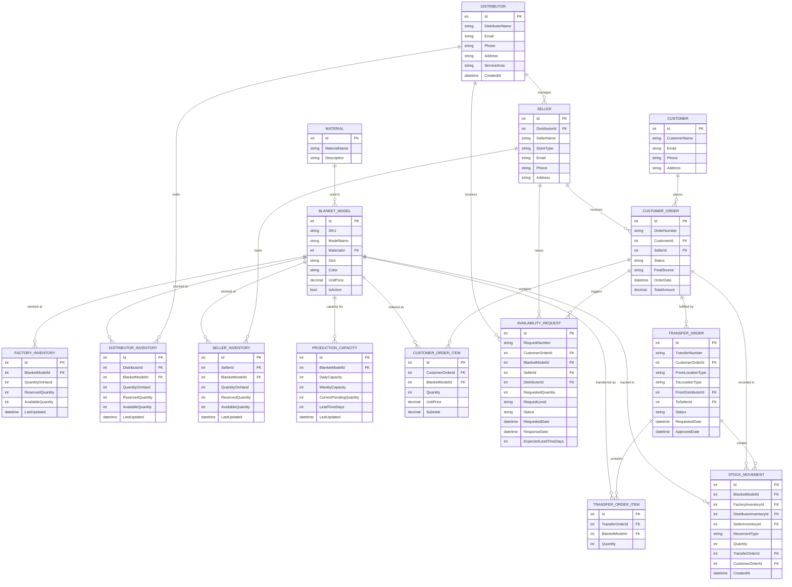

---

### 5.2 UML Class Diagram

The following UML Class Diagram shows the layered architecture of the Cozy Comfort SOA solution — the key classes, their attributes, methods, and inter-layer relationships.

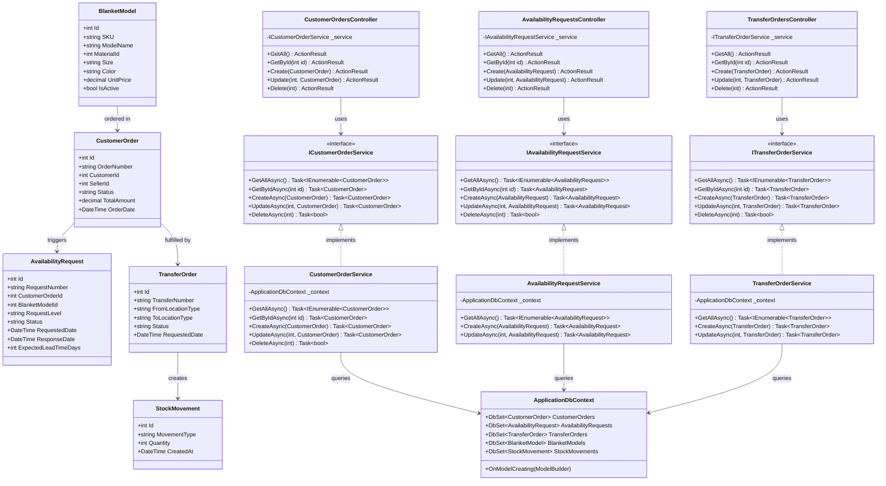

---

### 5.3 Use Case Diagram

The following Use Case Diagram describes all system interactions across the four actors: **Customer**, **Seller**, **Distributor**, and **Manufacturer**.

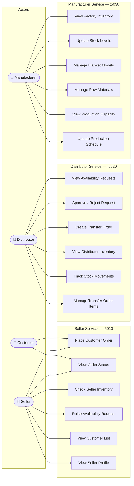

---

### 5.4 Use Case Descriptions

| Use Case | Actor | Description | Pre-condition | Post-condition |
|----------|-------|-------------|--------------|----------------|
| Place Customer Order | Customer, Seller | Customer requests a blanket; Seller records the order | Customer and Seller exist in the system | CustomerOrder record created with status "Pending" |
| View Order Status | Customer, Seller | Check the current fulfilment stage of an order | CustomerOrder exists | Current status displayed |
| Check Seller Inventory | Seller | View stock levels held at the seller's location | Seller is authenticated | SellerInventory records returned |
| Raise Availability Request | Seller | Request stock from the assigned Distributor when own stock is zero | CustomerOrder exists; SellerInventory is empty | AvailabilityRequest created with status "Pending" |
| Approve / Reject Request | Distributor | Distributor checks their own stock and responds to the request | AvailabilityRequest exists with status "Pending" | AvailabilityRequest updated to "Approved" or "Rejected" |
| Create Transfer Order | Distributor | Physically move stock from distributor location to seller | AvailabilityRequest approved | TransferOrder and TransferOrderItems created |
| View Distributor Inventory | Distributor | View current stock levels at the distributor's warehouse | — | DistributorInventory records returned |
| Track Stock Movements | Distributor | View audit trail of all inventory changes | — | StockMovement records returned |
| View Factory Inventory | Manufacturer | View what quantity of each blanket model is available at the factory | — | FactoryInventory records returned |
| Update Stock Levels | Manufacturer | Adjust inventory after a production run is completed | Production run completed | FactoryInventory.QuantityOnHand updated |
| Manage Blanket Models | Manufacturer | Create, update, or deactivate blanket SKUs | — | BlanketModel records created or updated |
| Manage Raw Materials | Manufacturer | Add or update raw material types used in production | — | Material records created or updated |
| View Production Capacity | Manufacturer | Check daily/weekly output capacity per blanket model | — | ProductionCapacity records returned |
| Update Production Schedule | Manufacturer | Adjust pending quantities and lead times | — | ProductionCapacity.LeadTimeDays and CurrentPendingQuantity updated |

---

### 5.5 Sequence Diagram — Full Order Fulfilment Workflow

The following sequence diagram traces the complete end-to-end journey of a customer order where the seller has no stock, the distributor has stock, and a transfer order fulfils the request.

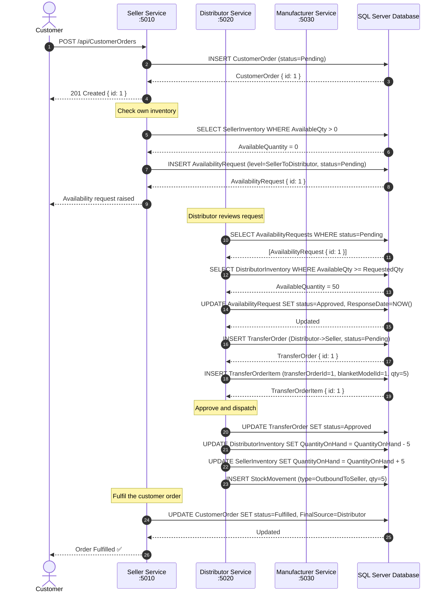

---

### 5.6 Sequence Diagram — Escalation: Distributor Out of Stock

This sequence diagram shows the escalation path when the Distributor also has no stock and must request from the Manufacturer.

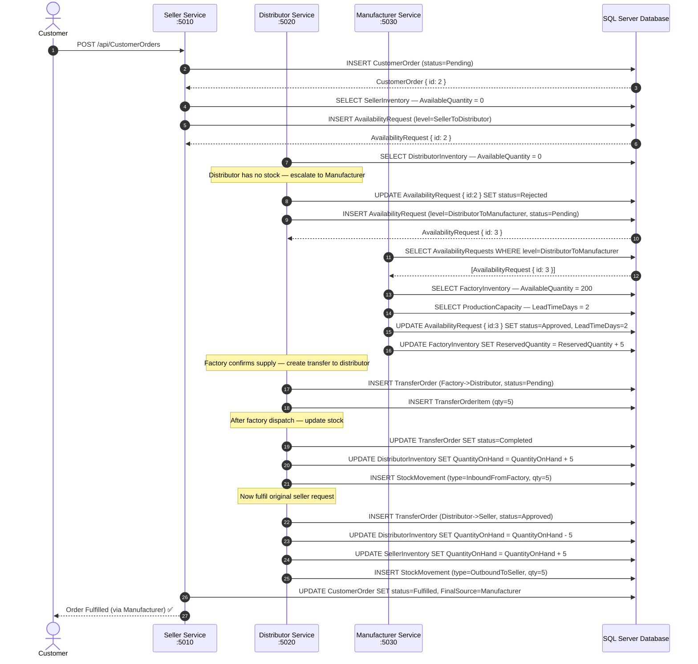

---

### 5.7 Sequence Diagram — API Documentation Access (Scalar)

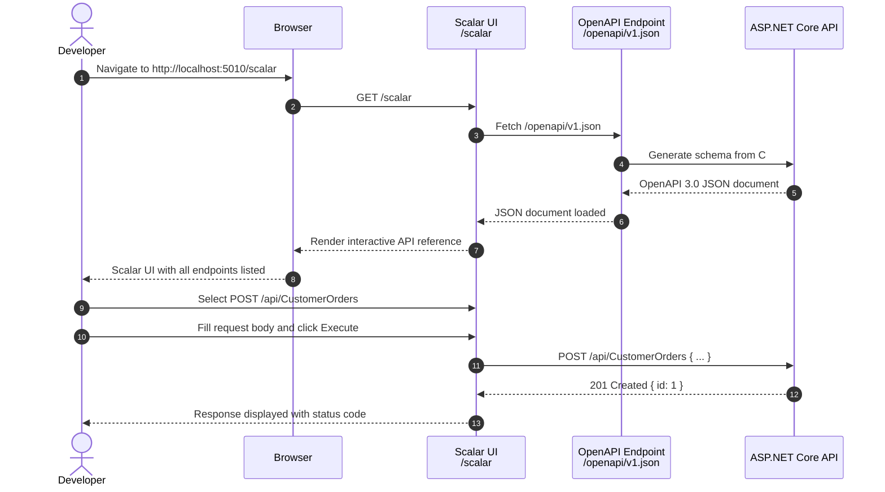

---

### 5.8 Component Diagram — SOA Deployment View

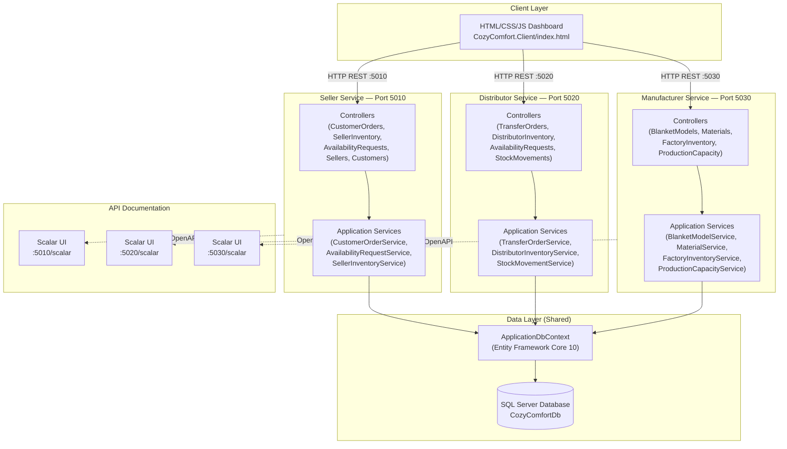

